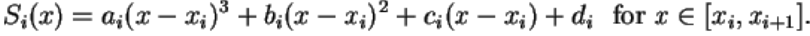
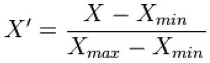
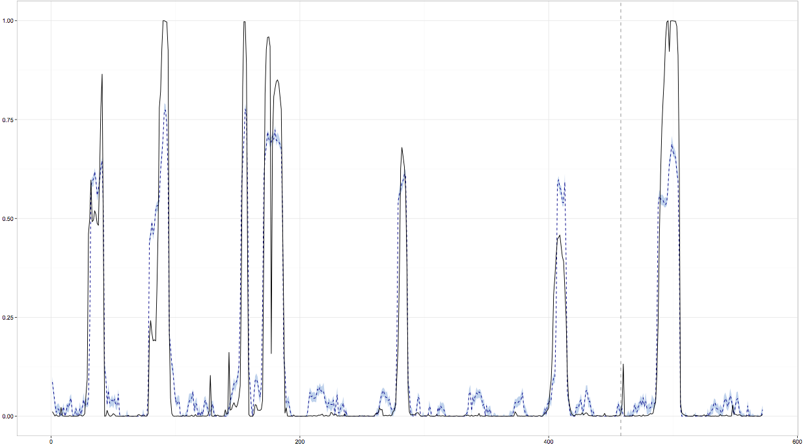
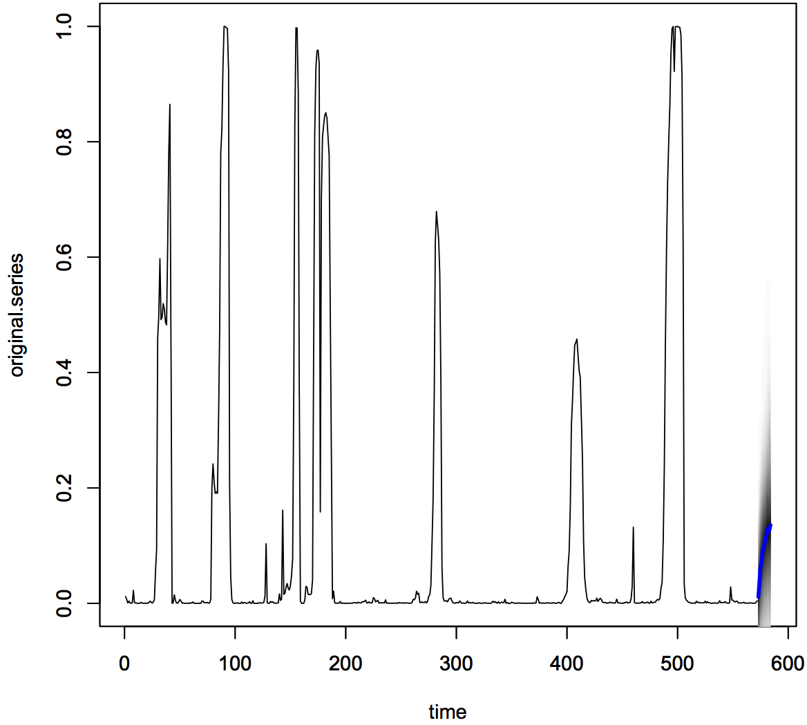

# Prediction Using Bayesian Structural Time Series
Jeshua Kracht

### Requirements:
Mac OS 12.x

### Technical Problem:
The Federal Reserve has a huge amount of data on the economy of the United States containing information of varying accuracy, relevance, and completeness. Many times series contain vital data about the state of the economy, but do not tell the whole story by themselves. Often, in hindsight, many indicator variables forecasted recessions and depressions before the markets crashed. Detecting symptoms of impending recession across hundreds of time series can be difficult. Much of the available data is noisy and, because of the ever changing nature of the economy, each recession has a slightly different signature. The challenge is to intelligently pair down dimensions and dynamically recognize warning signs based on prior multivariate time series data values without overfitting to only recognize historical recessions. This problem space is applicable to a massive number of problems and, as such, my solution is generic enough to work with essentially any multivariate time series prediction problem.

### DSDP Description:
1. Fill in missing and sparse data using Cubic Spline Interpolation.

2. Normalize values.

3. Pass training data to model.
4. Given the current state, model parameters, and y, calculate Spike and Slab prior (built in
variable selection).

[Link to Spike and Slab Prior Paper](http://arxiv.org/pdf/math/0505633.pdf)

5. Use Markov Chain Monte Carlo regression to sample at specific probability interval based on Spike and Slab prior.

See Detailed model form description below.

6. Repeat steps 4 and 5 n times.
7. Using Bayesian output, predict value of y for remaining test data.
8. Kernel Smooth output (where applicable).

[Link to Daniell Kernel Explaination](http://www.stat.berkeley.edu/~aditya/resources/LectureTWENTYSIX.pdf)

9. Restrict output value range.
10. Validate actual vs. model prediction (visual inspection).
11. If validation succeeds, choose and build the best AutoRegressive Integrated Moving Average model for each x time series based on Akaike and Bayesian Information Criterion penalties.

[Link to Akaike and Bayesian Information Criterion Paper](http://xyala2.bio.ed.ac.uk/teaching/tutorials/phylogenetics/Bayesian_Workshop/PDFs/Posada%20and%20Buckley%20Syst%20Biol%202004.pdf)

12. Forecast n number of future values for each x time series based on selected model.
13. Repeat steps 3-7 using all historical values as training data and forecasted values of x to
predict y.

The tool, Causal Impact, is heavily based on Bayesian Structural Time Series and uses three metrics for prediction:

  1. The Time-Series behavior response to itself.
  2. The predictive behavior of other Time-Series on y.
  3. Counter-factual inference based on prior knowledge about model parameters.
  The model form is a Markov Chain Monte Carlo Bayesian approach.

Where the model parameters are θ = {σε,σu,σv,σw,β} and the state is α = {α1,...,αn}, the Markov Chain Monte Carlo algorithm is:

1. Draw α given y and θ
  a. Use the Kalman filter which is a forward filter - backward sampler
  b. Draw α
2. Draw θ given α
  a. Given α [σu],[σv],[σw],[β,σε] are conditionally independent
  b. Independent priors on the time series σ’s
  c. Spike and Slab prior on β

Spike and Slab is vital to the Markov Chain Monte Carlo calculations because it serves as the penalty function. The Markov Chain Monte Carlo calculations use this penalty and Bayesian induction algorithm over n iterations to do variable selection.

### DSDP Applied:
Using the Quandl economic data API, I retrieved the 281 time series, available from the Federal Reserve Economic Data set, to use in predicting the probability of recession. The 281 variables were selected based on two complimentary ontologies available on the Federal Reserve Economic Data website. These variables vary greatly in start date, completeness, and frequency. By backfilling 0 values into the data for time series that began later than 1967, which is the first datapoint for y, I was able to pass valid data to the model without affecting the accuracy of the prediction. Additionally, I filled in missing month values from yearly and quarterly series using cubic spline interpolation. This noise created more variance, but produced more accurate results. My dataset contains 571 month data-points from Jun 1967 to Jan 2015. The first 80% of months were used to train the model and the last 20% were used for testing. Before passing the data to the model, I normalized all the data to range from 0 to 1.

CausalImpact, the R function that creates a Bayesian Structural Time Series model which, in turn, runs the Spike Slab and Markov Chain Monte Carlo calculations, accepts a few optional parameters: the number of iterations, the number and length of seasons, the confidence interval, and a custom Bayesian Structural Time Series model. After meticulously experimenting with each parameter, the only parameter I changed from its default value was “alpha”, the confidence interval. By default, the confidence interval is 95%, but by changing it to 90% I was able to significantly improve the predictive accuracy of the model. No significant improvement could be made by increasing the number of iterations or providing a custom Bayesian Structural Time Series model. By setting the number of seasons to two with a length of 6 months I was able to improve the accuracy of the prediction slightly, but at the cost of a large increase in variance. Additionally, to gain a better understanding of the inner workings of the Bayesian Structural Time Series model itself, I built a custom Bayesian Structural Time Series model with many custom parameters set and ran the prediction myself without CausalImpact, achieving almost identical results.

Once the modeling was complete, I used Daniell Kernel Smoothing with a window size of 10 to remove much of the unnecessary noise around zero. However, as analyzing the data and optimizing the model further, I believe in most cases kernel smoothing is not ideal for this problem. Following that, I replaced all the negative values with zero and all the values over one with one, to stay within the range of possibility. The results below show a model that is quite accurate between 1 and 18 months into the future. The model coefficients contain a value representing the usefulness of each of the 281 variables to the final calculation. Unsurprisingly, the variable selection embedded in the model itself showed that around 70 variables were included in the model more than 10% of the time, for a list of selected variables, see below. I am certain there are other variables, within the roughly 140,000 variables available in the Federal Reserve Economic Data set, that have strong predictive correlation to the probability of recession; however, the model already has strong predictive abilities using only a few variables. In fact, my model is able to successfully predict the “Great Recession” of 2008-2009 within one month, as shown in the graphs below. Changes to the one variable can been seen to have a noticeable effect on the prediction showing this model provides extremely intriguing counter-factual inference.

In order to expand my understanding and test the model further, I used the auto.arima R function which uses Akaike and Bayesian Information Criterion penalties to select the best model for each x time series. Once a model was selected, I used each to forecast 12 months of future values for each x. Using all the historical data as training data, I built custom a new Bayesian Structural Time Series model to predict future values of y. Because I only used data though Jan 2015 to train my original validation model I still have 11 months of historical data to compare to my results of y based on my predicted future values of each x. Once again, my results match actual almost perfectly, indicating a minor spike in the probability of recession happening right now, see graph 3.

### Sample Output
**Model Fit** 
Black Line: Probability of Recession 
Dashed Blue: Model Fit 
Light Blue: Prediction Variance 
Dashed Grey Vertical Line: Separation of Pre/Post Period

**Model Validation**

**Prediction Beyond Known**

### References:
http://static.googleusercontent.com/media/research.google.com/en/pubs/archive/41854.pdf 
http://statmath.wu.ac.at/research/talks/resources/slidesscott.pdf 
https://research.stlouisfed.org/fred2/ 
https://www.quandl.com/tools/r 
http://jeremykun.com/2015/04/06/markov-chain-monte-carlo-without-all-the-bullshit/ 
http://robjhyndman.com/talks/MelbourneRUG.pdf 
https://github.com/cran/bsts 
https://github.com/google/CausalImpact 
https://cran.r-project.org/web/packages/forecast/forecast.pdf 
https://cran.r-project.org/web/packages/biganalytics/biganalytics.pdf 
http://www.inside-r.org/r-doc/stats/kernel 
https://www.khanacademy.org/math/probability/probability-and-combinatorics-topic/probability_combinatorics/v/conditional-probability-and-combinations 
https://www.youtube.com/watch?v=12eZWG0Z5gY 
http://www-stat.wharton.upenn.edu/~edgeorge/Research_papers/GeorgeMcCulloch97.pdf 
http://xyala2.bio.ed.ac.uk/teaching/tutorials/phylogenetics/Bayesian_Workshop/PDFs/Posada%20and%20Buckley%20Syst%20Biol%202004.pdf 
http://www.stat.purdue.edu/~mlevins/STAT598K_2012/Box_Pierce_1970.pdf 
http://xyala2.bio.ed.ac.uk/teaching/tutorials/phylogenetics/Bayesian_Workshop/PDFs/Alfaro%20et%20al%20Mol%20Biol%20Evol%202003.pdf 
http://www.stat.berkeley.edu/~aditya/resources/LectureTWENTYSIX.pdf 
http://arxiv.org/pdf/math/0505633.pdf 
